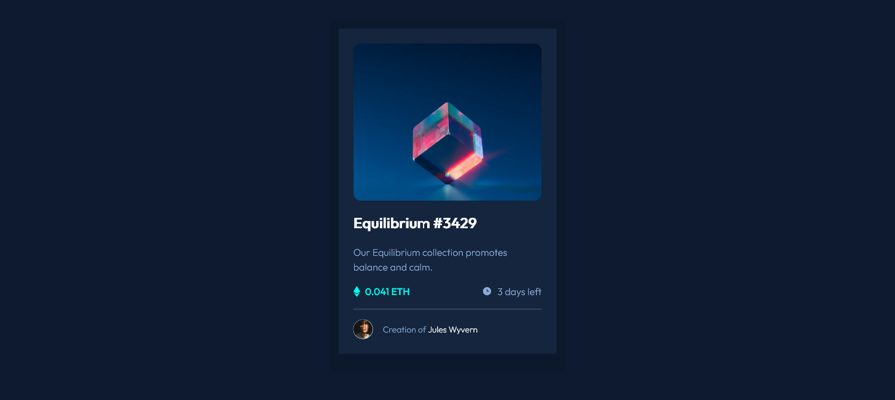

# Frontend Mentor - NFT preview card component solution

This is a solution to the [NFT preview card component challenge on Frontend Mentor](https://www.frontendmentor.io/challenges/nft-preview-card-component-SbdUL_w0U).

## Table of contents

- [Overview](#overview)
  - [The challenge](#the-challenge)
  - [Screenshot](#screenshot)
  - [Links](#links)
- [My process](#my-process)
  - [Built with](#built-with)
  - [What I learned](#what-i-learned)
  - [Continued development](#continued-development)
  - [Useful resources](#useful-resources)
- [Author](#author)
- [Acknowledgments](#acknowledgments)

## Overview

### The challenge

Users should be able to:

- View the optimal layout depending on their device's screen size
- See hover states for interactive elements

### Screenshot



### Links

- Solution URL: [FrontendMentor.io](https://www.frontendmentor.io/solutions/frontend-mentor-nft-preview-card-component-solution-hZcHu-QMw)
- Live Site URL: [Vercel URL](https://prj-12-nft-preview-card-component.vercel.app/)

## My process

### Built with

- Semantic HTML5 markup
- Flexbox
- CSS Grid
- Mobile-first workflow
- [Vitejs](https://vitejs.dev/) - Frontend Development Framework
- [Tailwindcss](https://tailwindcss.com) - A utility-first CSS framework

### What I learned

Arbitrary values in Tailwindcss
If you need to use a one-off border-{side}-{width} value that doesn’t make sense to include in your theme, use square brackets to generate a property on the fly using any arbitrary value.

```css
<div
        class="
          text-project
          font-outfit
          my-8
          p-6
          rounded-xl
          max-w-xs
          mx-auto
          border-x-[15px]
          border-t-[15px]
          border-b-[30px]
          border-borderBackground
        "
      >
```

Changing image opacity on hover

```html
<div
  class="
              bg-personalizedcyan
              w-full
              h-full
              rounded-xl
              flex
              justify-center
              items-center
              opacity-0
              hover:opacity-70
            "
>
  
</div>
```

Personalizing Tailwindcss

```css
module.exports = {
  content: ["./index.html", "./src/**/*.{vue,js,ts,jsx,tsx}"],
  theme: {
    extend: {
      colors: {
        softblue: "hsl(215, 51%, 70%)",
        personalizedcyan: "hsl(178, 100%, 50%)",
        verydarkbluemainbg: "hsl(217, 54%, 11%)",
        verydarkbluecardbg: "hsl(216, 50%, 16%)",
        verydarkblueline: "hsl(215, 32%, 27%)",
        personalizedwhite: "hsl(0, 0%, 100%)",
        screenBackground: "hsla(218, 56%, 12%, 1)",
        borderBackground: "hsla(218, 58%, 11%, 1)",
      },
      fontFamily: {
        outfit: ["Outfit", "sans-serif"],
      },
      fontSize: {
        project: "1.125rem",
      },
      backgroundImage: {
        iconEthereum: "url('/images/image-equilibrium.jpg')",
      },
    },
  },
  plugins: [],
};
```

### Continued development

In this project I have applied more concepts of TailwindCSS. However this makes easy because of previous background in CSS basics.

### Useful resources

- [TailwindCSS Directives](https://tailwindcss.com/docs/functions-and-directives) - Use of @apply directive
- [Customizing Colors in TailwindCSS](https://tailwindcss.com/docs/customizing-colors) - Adding personalized color names to be used in tailwindcss.
- [Customizing Fonts in TailwindCSS](https://tailwindcss.com/docs/font-family#using-custom-values) - Adding Google fonts to be used in tailwindcss.

## Author

- Website - [Gustavo Sanchez](https://www.gusanche.dev)
- Frontend Mentor - [@gusanchedev](https://www.frontendmentor.io/profile/gusanchedev)
- Github - [@gusanchedev](https://www.github.com/gusanchedev)
- Twitter - [@gusanchedev](https://www.twitter.com/gusanchedev)
- Linkedin - [gusanchedev](https://www.linkedin.com/in/gusanchedev/)

## Acknowledgments

Thanks to Mariapaz for being my friend and support 💙
